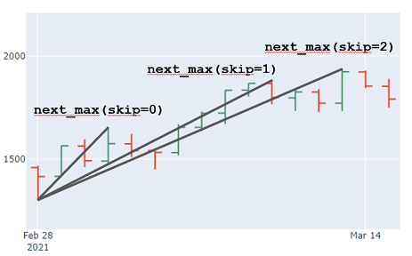

# ElliottWaveAnalyzer
First Version of an (not yet) iterative Elliott Wave scanner in financial data.

## Setup
Use a Python 3.9+ environment (tested on 3.13) and install all packages via
`pip install -r requirements.txt`

Static chart export uses [`kaleido`](https://pypi.org/project/kaleido/), which
drives a headless browser under the hood; the pinned versions
(`plotly==6.6.0`, `kaleido==1.3.0`) are the combination this project is
verified against.

## Quickstart
Start with `example_monowave.py` to see how the basic concept (finding monowaves) works and play with the parameter `skip_n`.

Then have a look into `example_12345_impulsive_wave.py` to see how the algorithm works for finding 12345 impulsive movements.

Running an example scans the price data and writes one PNG per detected
pattern into an `images/` folder (created automatically on first run).

## Helper
Use `get_data.py` script to download data directly from yahoo finance.

# Algorithm / Idea
The basic idea of the algorithm is to try **a lot** of combinations of possible wave
patterns for a given OHLC chart and validate each one against a given
set of rules (e.g. against an 12345 impulsive movement).

# Class Structure
## MonoWave
The smallest element in a chart (or a trend) is called a MonoWave: 
The impulsive movement from a given low (or high) to the next high 
(or down to the low), where each candle (exactly: high / low) 
forms a new high (or new low respectively). 

The MonoWave ends, once a candle breaks this "micro trend".

There is `MonoWaveUp` and the `MonoWaveDown`, denoting the direction of the wave.

### WaveOptions
`WaveOptions` are a set of integers denoting how many of the (local) highs or lows should be
skipped to form a MonoWave.

### Parameters
The essential idea is, that with the parameter `skip=`, smaller corrections can be skipped. In case of an upwards trend, 
e.g. `skip=2` will skip the next 2 maxima.



## WavePattern
A `WavePattern` is the chaining of e.g. in case for an Impulse 5 `MonoWaves` (alternating between up and down direction). It is initialized with a list of `MonoWave`.

## WaveRule
`WavePattern` can be validated against a set of rules. E. g. form a valid 12345 impulsive waves, certain rules have to apply for the 
monowaves, e.g. wave 3 must not be the shortest wave, top of wave 3 must be over the top of wave 1 etc. 

Own rules can be created via inheritance from the base class. There are rules
implemented for 12345 Impulse. Leading Triangle and for ABC Corrections.

To create an own rule, the `.set_conditions()` method has to be implemented for every inherited rule. The method has a `dict`, having
arbitrarily named keys, having `{'waves': list 'function': ..., 'message': ...}` as value.

For `waves` you pass a list of waves which are used to validate a specific rule, e.g. `[wave1, wave2]`.

For `function` you use a `lambda` function to check, e.g. `lambda wave1, wave2: wave2.low > wave1.low`

For `message` you enter a message to display (in case `WavePattern(..., verbose=True)` is set).

Note that only if all rules in the `conditions` are `True` the whole `WaveRule` is valid.

### Check WavePattern against Rule
Once you have a `WavePattern` (chaining of 5 `MonoWave` for an impulse or 3 `MonoWave` for a correction)
 You can check against a `WaveRule` via the `.check_rule(waverule: WaveRule)` method.

## WaveCycle
A `WaveCycle` is the combination of an impulsive (12345) and a corrective (ABC) movement.
Not working atm.

## WaveAnalyzer
Is used to find impulsive and corrective movements.
Not working atm.

### WaveOptionsGenerator
There are three `WaveOptionsGenerators` available at the moment to fit the needs for creating
tuples of 2, 3 and 5 integers (for a 12 `TDWave`, an ABC `Correction` and a 12345 `Impulse`).

The generators already remove invalid combinations, e.g. [1,2,0,4,5], as after selecting the next minimum (3rd index is 0), for the 4th and 5th wave skipping is not allowed.

As unordered sets are used, the generators have the `.options_sorted` property to go from low numbers to high ones. This means that
first, the shortest (time wise) movements will be found.

## Helpers
Contains some plotting functions to plot a `MonoWave` (a single movement), a `WavePattern` (e.g. 12345 or ABC) and a `WaveCycle` (12345-ABC).

# Plotting
For different models there are plotting functions. E.g. use `plot_monowave` to plot a `MonoWave` instance or `plot_pattern` for a `WavePattern`.

Each plotting function builds a `plotly` figure and saves it as a timestamped
PNG in the `images/` folder (charts are exported to disk, not opened in a
browser). All exports share a single persistent `kaleido` browser that is
started once and reused, so scanning a chart with many matches stays fast and
avoids per-figure browser churn.

# Signal Report (`elliott_wave_report.py`)

The `models/` core brute-forces *micro* impulses from a single bar and is poor at
answering "what wave is the daily chart in **now**". `elliott_wave_report.py` is a
higher-level tool built for a tradable read: it reduces the daily series to its
significant swings, labels the legs 1-2-3-4-5 / A-B-C, validates the core Elliott
rules, reads the currently-forming leg to pick a BUY/SELL signal, computes
Fibonacci buy-zones and targets, and renders a self-contained interactive HTML
report.

```bash
python elliott_wave_report.py            # writes reports/<TICKER>_elliott_report.html
```

Configure at the top of the file:

| Setting | Meaning |
|---------|---------|
| `TICKER`, `START` | instrument and history start (downloaded via `yfinance`) |
| `CURRENCY` | price symbol (`₹` default; `$` for USD tickers) |
| `PIVOT_METHOD` | swing detector: `'peaks'` (scipy, default) or `'zigzag'` |
| `ZIGZAG_PCT` | ZigZag reversal threshold (zigzag method) |
| `PIVOT_PROMINENCE_PCT`, `PEAK_DISTANCE` | prominence / spacing (peaks method) |
| `RECENT_PIVOTS` | how many recent swings to anchor the count within |

## Swing detectors
Two interchangeable pivot detectors feed the same counting engine:

- **`zigzag`** — classic percentage-reversal filter (`ZIGZAG_PCT`).
- **`peaks`** — `scipy.signal.find_peaks` with prominence set as a fraction of the
  median price, forced to strictly alternate H/L. Often resolves cleaner swings on
  trending data.

## Fibonacci levels
Retracements (the buy-zone) and **upside extension targets** (1.272×/1.618×/2.618×)
are computed by `fibonacci_calculator.py` — a standalone calculator for
retracements, extensions, projections and wave relationships.

## Book count — Frost & Prechter overlay
The report also renders a **primary-degree A-B-C** reading per *Elliott Wave
Principle*: it identifies the whole-series five-wave impulse, labels the decline off
the top as wave A and the bounce as wave B, projects wave C by Fibonacci multiples
of A, and marks the 50–61.8% impulse-retracement target band. It states a
plain-language stance (bull-continuation / wave-B bounce / wave-C underway) and
flags C-targets that would breach the impulse origin as invalid.

## Examples
- `example_silver.py` — `WaveAnalyzer` impulse/leading-diagonal scan on silver (SI=F).
- `example_cupid_india.py` — the same scan on Cupid Ltd (CUPID.NS).
- `silver_report.py` — generates the HTML report for silver with **both** swing
  detectors side by side (`reports/SI=F_<method>_elliott_report.html`).

> Elliott wave counts are inherently subjective and are revised as new bars print;
> the swing threshold changes the count. This is educational analysis, not
> investment advice.

# Credits & License
This project is derived from the upstream
[drstevendev/ElliottWaveAnalyzer](https://github.com/drstevendev/ElliottWaveAnalyzer)
(the `models/` core, examples, and algorithm are its work). The upstream
repository does not carry a license, so the original code is **all rights
reserved** by its author(s); it is included here for study and personal use.

No separate open-source license is applied to this fork, as it cannot
relicense the upstream code. Local changes here (persistent-kaleido chart
export, dependency pins, and documentation) are offered under the same terms.
